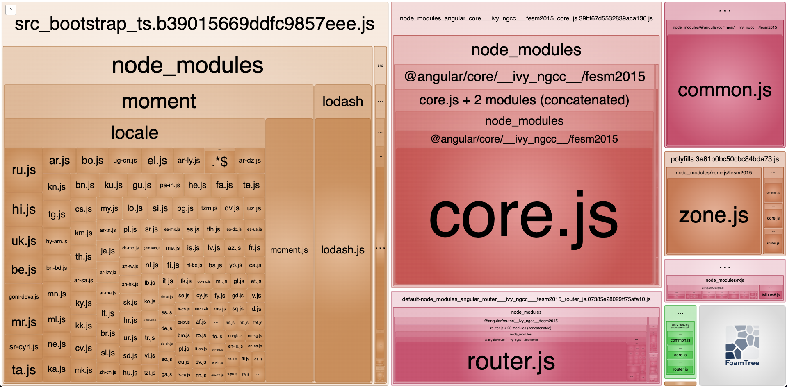
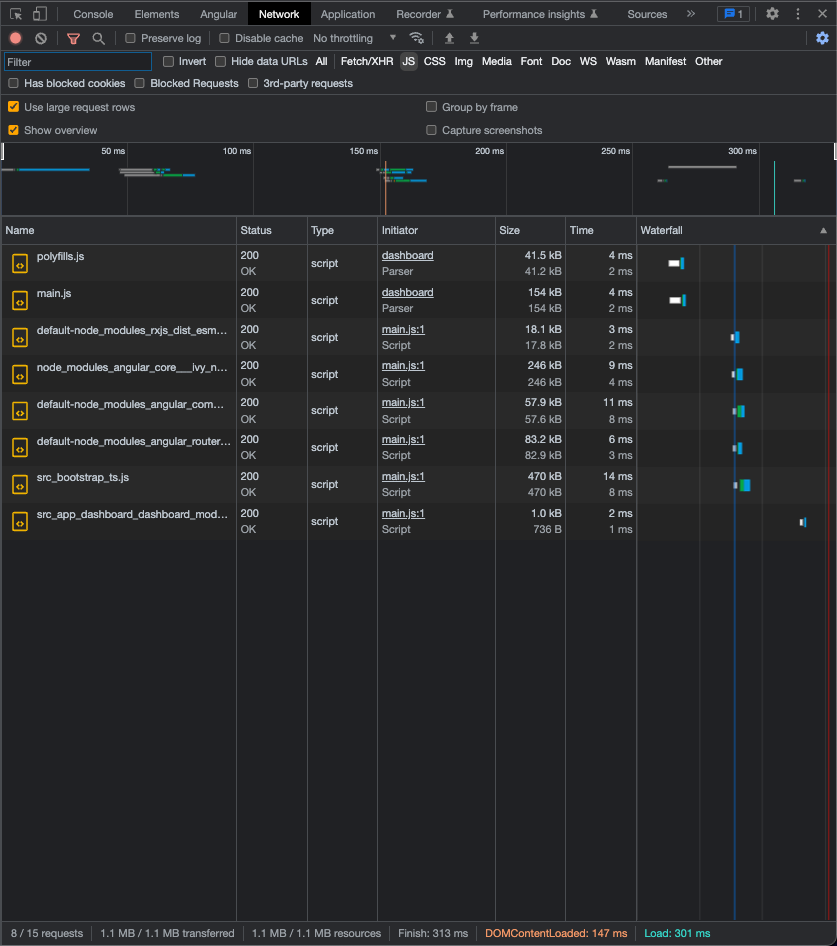
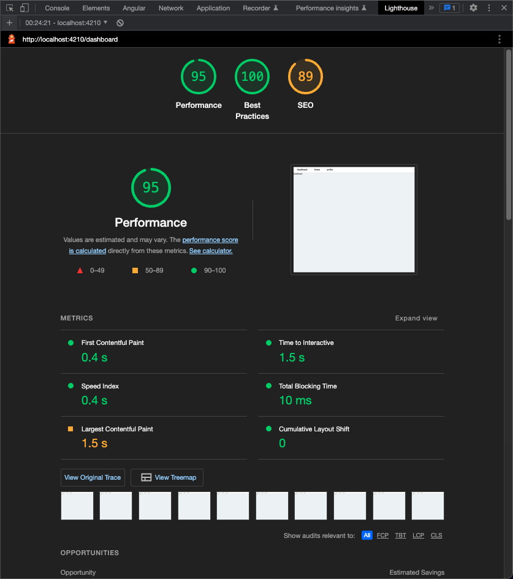
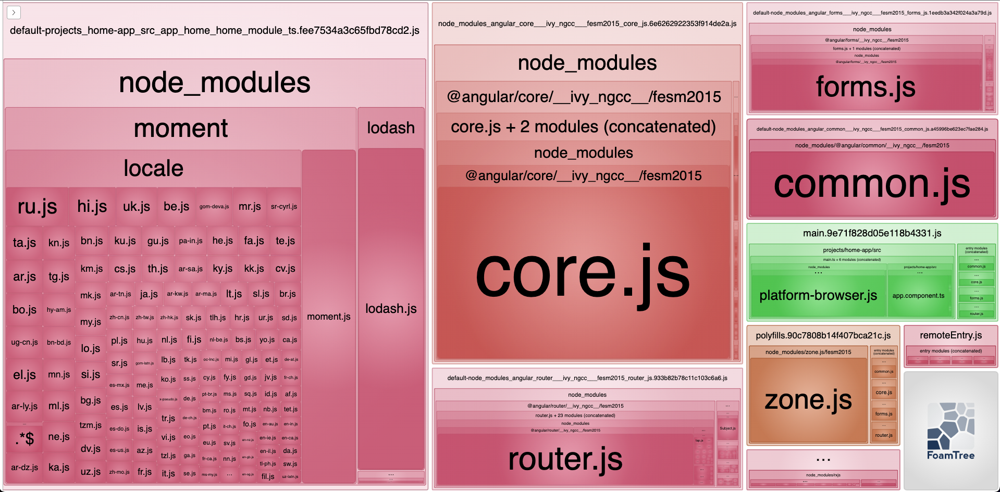
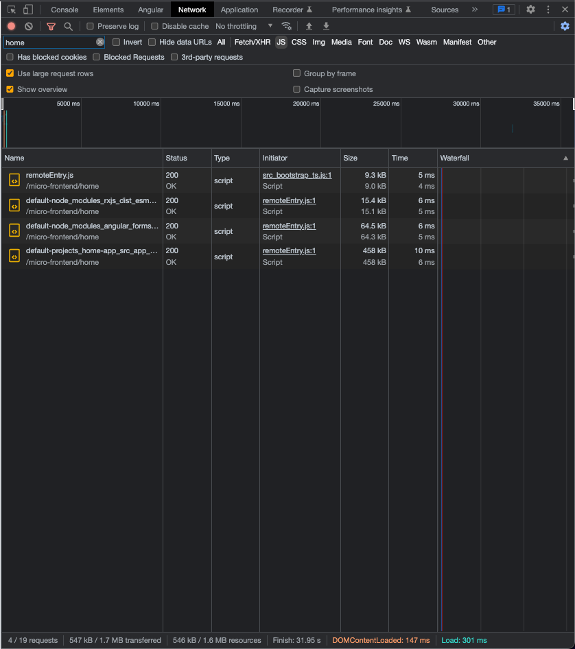
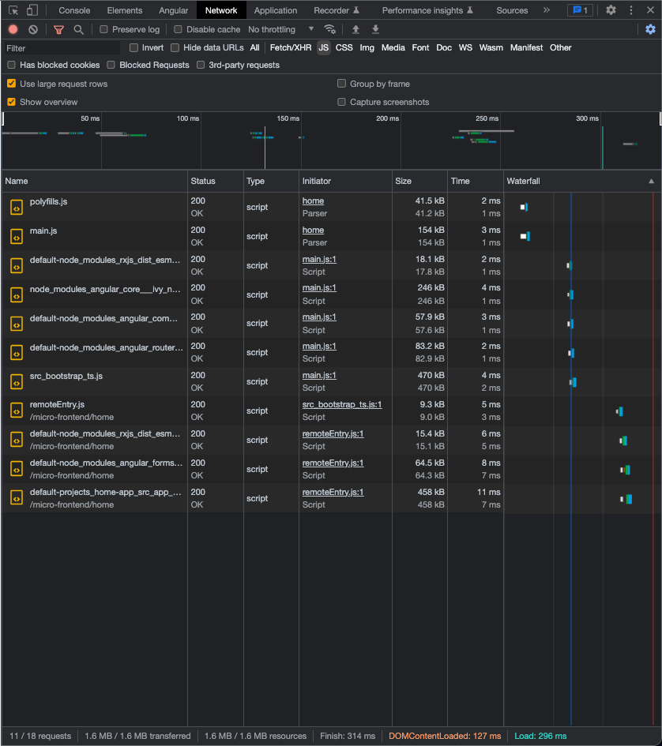
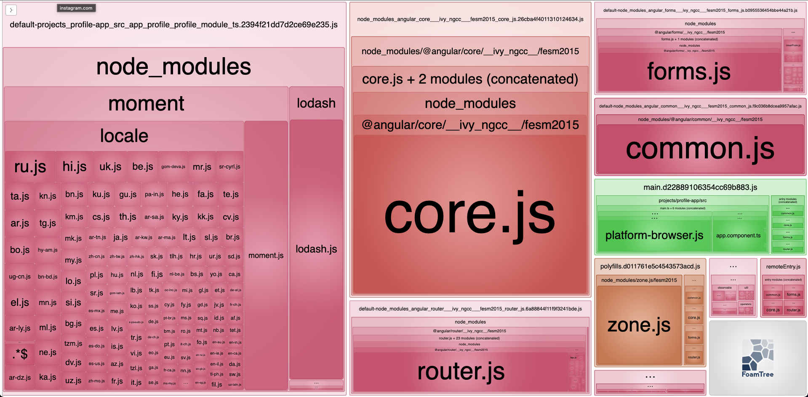
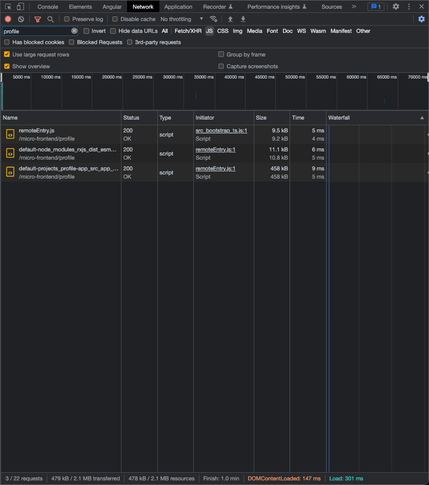
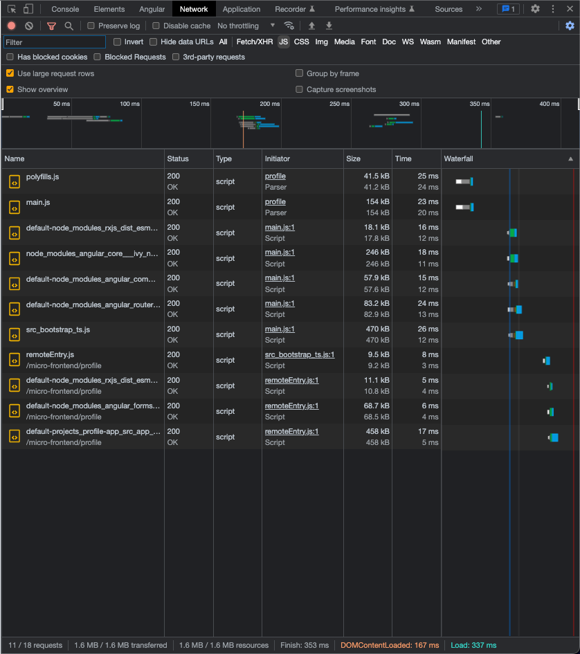

### Summary

This document contains comparison of different configurations in terms of network aspects and bundle sizes.

### Motivation

As you may know or not, the packages shared with Module federation configuration, are not **tree-shakable!** Since webpack can not know what part of the shared package could be consumed in runtime by another remote, shared packages are not eligible for tree-shaking!

### Note

Normally, the examples you find online contains only framework packages without any other 3rd party dependencies. While this can be misleading, also does not really reflect a real world use case.

For this purpose, two famous packages are added to repo with dummy usages,

- [moment](https://github.com/moment/moment) (non-tree-shakable, added on purpose to use it as shared and not shared)
- [lodash](https://github.com/lodash/lodash) (perfectly tree-shakable)

Dramatically, existence of those two packages already increased the bundle sizes to almost **1Mb** (without compression).

### Comparisons

#### 1 - configuration eager:false in host and remote applications

#### HOST

This is the default setting in this example applications.

- Bundle analyze for host application

  

- Assets transferred over network for host application

  

- Lighthouse measurements for page load

  

#### HOME

- Bundle analyze for home application

  

- Assets transferred over network for home application after navigation from dashboard

  

- Assets transferred over network for home application after refresh in home

  

- Lighthouse measurements for page load

  

#### PROFILE

- Bundle analyze for home application

  

- Assets transferred over network for profile application after navigation from dashboard

  

- Assets transferred over network for profile application after refresh in profile

  

- Lighthouse measurements for page load

  

##### Pros:

- Smaller bundle size
- Better page load performance

##### Cons:

- Too many initial file requests

#### 2 - configuration eager:true in host and remote applications

In order to see the difference, replace

```javascript
shared: getSharedPackages()
```

part of the configuration in three **webpack.config.js** file with:

```javascript
shared: getSharedPackages(true)
```

#### HOST

This is the default setting in this example applications.

- Bundle analyze for host application

  

- Assets transferred over network for host application

  

- Lighthouse measurements for page load

  

#### HOME

- Bundle analyze for home application

  

- Assets transferred over network for home application after navigation from dashboard

  

- Assets transferred over network for home application after refresh in home

  

- Lighthouse measurements for page load

  

#### PROFILE

- Bundle analyze for profile application

  

- Assets transferred over network for profile application after navigation from dashboard

  

- Assets transferred over network for profile application after refresh in profile

  

- Lighthouse measurements for page load

  

### Pros:

- Less number of asset requests

### Cons:

- bundles are filled with duplicates in main.js and polyfills.js
- worse initial load metrics
- currently there's already an open bug and resolved yet in this manner: https://github.com/module-federation/module-federation-examples/issues/693

Here are the cons for this configuration

#### 3 - shared mappings configuration with rxjs included and eager: true in host and remote applications

##### Pros:

Here are the pros for this configuration

##### Cons:

Here are the cons for this configuration

#### 4 - shared mappings configuration with rxjs included and eager: false in host and remote applications

##### Pros:

Here are the pros for this configuration

##### Cons:

Here are the cons for this configuration
